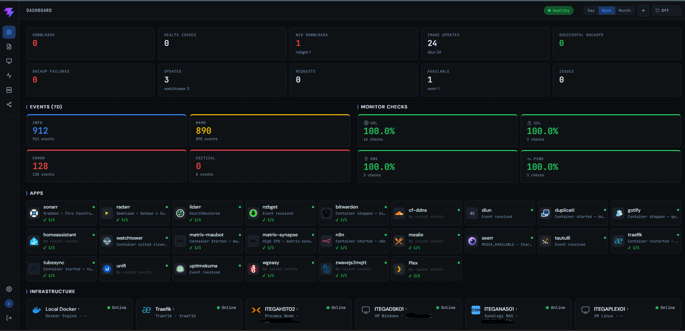

# N.O.R.A
### Nexus Operations Recon & Alerts

> Know what's happening in your homelab without it becoming a project.

NORA is a self-hosted monitoring, event capture, and notification platform for homelabbers and small self-hosted teams. One Docker image, one data directory, no pipelines to build. It just works.

---

## A Note on How This Is Built

NORA is built with **[Claude Code](https://claude.ai/code)**. Every feature goes through a tracked GitHub issue, every change is documented in PR notes, and nothing ships without being understood. Read the issue history and PRs — the process is the proof.

NORA is built on the shoulders of great open-source work — [see the full list of projects credited below](#built-on).

---

## What it does

NORA is three things in one binary:

- **A monitor** — ping, URL, SSL, and DNS checks on a schedule, plus direct integration with Docker, Proxmox, Portainer, Traefik, Synology, and SNMP for resource metrics and health.
- **An event capture service** — a webhook ingest endpoint that normalizes events from the apps you already run (Sonarr, Radarr, n8n, Duplicati, Ghost, and 20+ more) into a single searchable feed.
- **A notification router** — rule-based alerts over Web Push or email, plus a scheduled digest summary you can hand off to non-technical stakeholders.

Everything ships in one image, writes to one folder (`/data`), and runs on a Raspberry Pi or a full homelab rack equally well.

---

## Screenshot



More views: see [docs/screenshots/](docs/screenshots/).

---

## Core features

- **Monitor checks** — ping, URL, SSL, DNS with baseline reset
- **Webhook ingest** — normalized events from 29 built-in app profiles, plus a custom profile editor
- **Infrastructure integrations** — Docker, Proxmox, Portainer, Traefik, Synology, SNMP
- **Web Push + email notifications** — rules engine over any event field
- **Scheduled digest email** — weekly or monthly summary via SMTP
- **Two-factor auth** — TOTP with any authenticator app
- **Single binary, single data directory** — mount `/data`, done

For the full feature list, see [docs/FEATURES.md](docs/FEATURES.md).

---

## Quick Start

```bash
docker run -d \
  -p 8081:8081 \
  -v ./data:/data \
  -v /var/run/docker.sock:/var/run/docker.sock:ro \
  -e NORA_SECRET=your-secret-here \
  -e NORA_ADMIN_EMAIL=admin@example.com \
  -e NORA_ADMIN_PASSWORD=change-me \
  ghcr.io/digitalcheffe/nora:latest
```

Open `http://localhost:8081`, sign in with the bootstrap credentials, then add your first app.

All paths (database, app templates, icons, VAPID keys) live under `/data`. Bind-mount wherever you want that folder to persist.

---

## Configuration

### Environment variables

| Variable | Description | Default | Required |
|---|---|---|---|
| `NORA_SECRET` | JWT signing secret | — | **Yes** |
| `NORA_ADMIN_EMAIL` | Bootstrap admin email — used only when the users table is empty | — | **First run** |
| `NORA_ADMIN_PASSWORD` | Bootstrap admin password | — | **First run** |
| `NORA_PORT` | HTTP port | `8081` | No |
| `NORA_LOG_LEVEL` | Set to `debug` for verbose request logging | `info` | No |
| `NORA_TIMEZONE` | IANA timezone for the digest scheduler (e.g. `America/New_York`) | `UTC` | No |
| `NORA_VAPID_PUBLIC` | VAPID public key — auto-generated on first run if not set | — | No |
| `NORA_VAPID_PRIVATE` | VAPID private key — auto-generated on first run if not set | — | No |
| `NORA_VAPID_SUBJECT` | VAPID subject (mailto or URL) | `mailto:admin@localhost` | No |

### In-app settings

Runtime configuration lives in **Settings** inside the app — no env vars needed:

- SMTP server, credentials, from address, test email
- Digest frequency + schedule
- Password policy and MFA requirement
- Per-app webhook tokens, API polling auth, and rate limits
- Alert rules

---

## App library

NORA ships with **29 pre-built profiles**. Pick your app and NORA already knows how to handle its events.

| Category | Apps |
|---|---|
| Media | Plex · Sonarr · Radarr · Lidarr · Prowlarr · Tautulli · Seerr · TubeSync · NZBGet |
| Automation | n8n · Home Assistant · Mealie |
| Infrastructure | Traefik · UniFi · WG Easy · Homepage |
| Security & DNS | AdGuard Home · Cloudflare DDNS · Vaultwarden |
| Backup & Updates | Duplicati · What's Up Docker · DIUN |
| Notifications & Comms | Gotify · Ghost · Matrix · Matrix Admin · Maubot |
| Other | Uptime Kuma · Z-Wave JS to MQTT |

Custom profile editor lets you map any webhook payload to NORA's event model.

### Per-app setup guides

Several apps need a bit of extra wiring on their side to send the payload NORA expects. Reference configs live in [docs/examples/](docs/examples/):

| App | Reference |
|---|---|
| DIUN | [diun-webhook-config.md](docs/examples/diun-webhook-config.md) |
| Duplicati | [duplicati-webhook-config.md](docs/examples/duplicati-webhook-config.md) |
| Home Assistant | [home-assistant-webhook-config.md](docs/examples/home-assistant-webhook-config.md) |
| n8n | [n8n-webhook-config.md](docs/examples/n8n-webhook-config.md) |
| Seerr / Jellyseerr | [seerr-webhook-config.md](docs/examples/seerr-webhook-config.md) |
| Tautulli | [tautulli-webhook-config.md](docs/examples/tautulli-webhook-config.md) |
| What's Up Docker | [whatsupdocker-webhook-config.md](docs/examples/whatsupdocker-webhook-config.md) |

### NZBGet custom extension

NZBGet doesn't send webhooks natively, so NORA ships a tiny NZBGet extension — two files you drop into NZBGet's `ScriptDir` that fire a clean POST after each download. Grab [manifest.json](docs/examples/nzbget-webhook-manifest.json) and [main.py](docs/examples/nzbget-webhook-main.py) and follow the install notes at the top of `main.py`.

---

## Stack

| Layer | Choice |
|---|---|
| Backend | Go — single binary, zero runtime dependencies |
| Database | SQLite — single file, zero ops |
| Frontend | React + Vite — PWA, installable |
| Push | Web Push / VAPID — browser-native, no third party |
| Deployment | Single Docker image (~50 MB) |

3-stage Docker build: frontend → Go binary → `alpine:3.19` final image.

For the repository layout, data flow, database schema, and deployment internals, see [docs/ARCHITECTURE.md](docs/ARCHITECTURE.md).

---

## Built On

NORA would not exist without these open-source projects:

| Project | Role |
|---|---|
| [Go](https://go.dev/) | Backend runtime — single binary, zero dependencies |
| [SQLite](https://sqlite.org/) | Embedded database via [mattn/go-sqlite3](https://github.com/mattn/go-sqlite3) |
| [React](https://react.dev/) + [Vite](https://vitejs.dev/) | Frontend framework and build tool |
| [React Router](https://reactrouter.com/) | Client-side routing |
| [golang-jwt/jwt](https://github.com/golang-jwt/jwt) | JWT authentication |
| [SherClockHolmes/webpush-go](https://github.com/SherClockHolmes/webpush-go) | Web Push / VAPID notifications |
| [pquerna/otp](https://github.com/pquerna/otp) | TOTP two-factor authentication |
| [gosnmp/gosnmp](https://github.com/gosnmp/gosnmp) | SNMP polling |
| [robfig/cron](https://github.com/robfig/cron) | Scheduled task execution |
| [rs/zerolog](https://github.com/rs/zerolog) | Structured logging |

---

## Contributing

Code contributions: open an issue first so we can align on approach before you build.

Profile contributions: drop a YAML file in a GitHub issue or discussion and it will be reviewed for inclusion in the library.

---

## License

MIT
