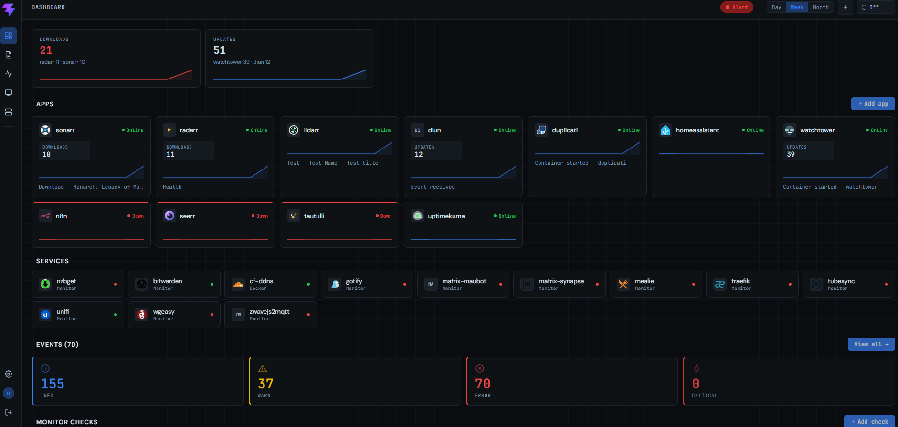

# N.O.R.A
### Nexus Operations Recon & Alerts

> Know what's happening in your homelab without it becoming a project.

NORA is a self-hosted monitoring, event capture, and notification platform built for homelabbers and small self-hosted teams. One Docker image. No pipelines to build. No dashboards to configure. It just works.

---

## A Note on How This Is Built

NORA is heavily developed with **[Claude Code](https://claude.ai/code)** by Anthropic. That comes with an honest disclaimer and an honest commitment.

The sentiment around AI-generated code is fair — the ecosystem is full of projects that got spun up overnight and abandoned just as fast. This isn't that. Every significant piece of work goes through a tracked GitHub issue, every change is documented in PR notes, and nothing ships without being understood. The goal is a solid, maintainable project — not a demo.

If you're evaluating NORA, read the issue history. Read the PRs. The process is the proof.

NORA is built on the shoulders of great open-source work — [see the full list of projects credited below](#built-on).

---

## The Problem

Every homelabber knows they *should* have better visibility into their stack. They know they should get notified before things break instead of after. But standing up Grafana + Prometheus + Loki + Alertmanager is a project, not a solution. So it never happens. And they stay blind.

NORA is what you get when you commit to the thing none of those tools committed to: **visibility without the work.**

---

## What It Does

| | |
|---|---|
| **Monitor** | Actively checks hosts, services, SSL certificates, and DNS on a schedule — no agent required |
| **Capture** | Receives webhook events from apps that support them (Sonarr, n8n, Duplicati, and more) |
| **Observe** | Connects to Docker, Proxmox, Portainer, Traefik, Synology, and SNMP targets for deep visibility |
| **Measure** | Collects CPU, memory, and disk from containers, VMs, and hosts automatically |
| **Store** | Retains events by severity with configurable retention — monthly rollups kept forever |
| **Alert** | Fires rules-based Web Push notifications to any subscribed browser or mobile device |
| **Summarize** | Delivers a scheduled digest email of what happened across your stack |

---
## Screenshots


More Screen Shots [Screenshots](https://github.com/Digitalcheffe/N.O.R.A/tree/main/.github/screenshots)
---
## Features

### Monitoring
- **Ping checks** — ICMP reachability on a schedule
- **URL checks** — HTTP/HTTPS with status code verification
- **SSL checks** — certificate expiry detection with configurable warning thresholds
- **DNS checks** — query validation with record type support
- Manual run, baseline reset, and per-check event history

### Event Capture
- Receive webhooks from any app via `POST /api/v1/ingest/{token}`
- Token-based auth per app — compromise one token, the rest are safe
- App profiles normalize payloads into NORA's event model automatically

### Infrastructure Integrations

| Integration | What NORA collects |
|---|---|
| **Docker** | Container discovery, resource metrics, health state, image update detection |
| **Proxmox** | Node status, VMs and LXC guests, storage, task failures, uptime |
| **Portainer** | Endpoints, container inventory, CPU/memory per container, image status |
| **Traefik** | Routes, services, SSL certificates |
| **Synology** | System status, storage, uptime |
| **SNMP** | Generic metrics and health from any SNMP-capable device |

### Notifications
- **Web Push** — browser-native push to desktop and mobile, no app store required
- **Alert Rules** — define conditions on any event field, fire notifications when they match
- **Digest Email** — scheduled summary of what happened across your stack via SMTP
- VAPID keys auto-generated on first run

### User Management
- Admin and Member roles
- Admin-controlled user creation with optional invite email on creation
- Per-user password management with configurable policy enforcement
- **Two-Factor Authentication (TOTP)** — time-based codes via any authenticator app (Google Authenticator, Authy, etc.)
- Global MFA enforcement with grace login and per-user exempt flag
- Disable TOTP without losing enrollment — re-enable without re-scanning

### Dashboard
- Summary counts, sparklines, and status rollup across apps, checks, and infrastructure
- Event timeline, check status, and resource trends in one view
- Clickable event cards with full payload detail

### Alert Rules
- Define conditions on any event field (severity, source, app, message, etc.)
- Combine conditions with AND / OR logic
- Fire Web Push or email notifications when a rule matches
- Enable, disable, or delete rules from the Settings → Notify Rules tab

### Topology
- Visual network map of your infrastructure, containers, apps, and routes
- Clickable nodes drill into component detail
- Automatically populated from Docker, Traefik, and infrastructure discovery

### App Library

NORA ships with 29 pre-built profiles. Pick your app and NORA already knows how to handle its events.

| Category | Apps |
|---|---|
| Media | Plex · Sonarr · Radarr · Lidarr · Prowlarr · Tautulli · Overseerr · Tubesync · NZBGet |
| Automation | n8n · Home Assistant · Mealie |
| Infrastructure | Traefik · Unifi · WG-Easy |
| Security & DNS | AdGuard Home · Cloudflare DDNS · Vaultwarden |
| Backup & Updates | Duplicati · Watchtower · DIUN |
| Notifications & Comms | Gotify · Ghost · Matrix · Maubot |
| Other | Uptime Kuma · Homepage · Zwavejs2mqtt |

Don't see your app? The custom profile editor lets you map any webhook payload to NORA's event model.

Profile contributions are welcome — drop a YAML file in a GitHub issue or discussion and it will be reviewed for inclusion in the library.

---

## Quick Start

```bash
docker run -d \
  -p 8081:8081 \
  -v ./data:/data \
  -v /var/run/docker.sock:/var/run/docker.sock:ro \
  -e NORA_SECRET=your-secret-here \
  ghcr.io/digitalcheffe/nora:latest
```

Open `http://localhost:8081` — create your admin account and add your first app.
## Configuration

### Environment Variables

| Variable | Description | Default | Required |
|---|---|---|---|
| `NORA_SECRET` | JWT signing secret | — | **Yes** |
| `NORA_ADMIN_EMAIL` | Bootstrap admin email — used only when the users table is empty | — | **First run** |
| `NORA_ADMIN_PASSWORD` | Bootstrap admin password | — | **First run** |
| `NORA_DB_PATH` | Path to SQLite database file | `/data/nora.db` | No |
| `NORA_TEMPLATES_PATH` | Path to app template YAML files | `/data/templates` | No |
| `NORA_ICONS_PATH` | Path to custom app icon overrides | `/data/icons` | No |
| `NORA_PORT` | HTTP port | `8081` | No |
| `NORA_LOG_LEVEL` | Set to `debug` for verbose request logging | `info` | No |
| `NORA_DIGEST_SCHEDULE` | Cron expression for digest email | `0 8 1 * *` | No |
| `NORA_TIMEZONE` | IANA timezone for digest scheduling (e.g. `America/New_York`) | `UTC` | No |
| `NORA_VAPID_PUBLIC` | VAPID public key — auto-generated on first run if not set | — | No |
| `NORA_VAPID_PRIVATE` | VAPID private key — auto-generated on first run if not set | — | No |
| `NORA_VAPID_SUBJECT` | VAPID subject (mailto or URL) | `mailto:admin@localhost` | No |

### In-App Settings
All email configuration is managed in the app under Settings → Notifications — no env vars needed.

- SMTP server, port, credentials, from address, and test email
- Password policy (minimum length, uppercase, numbers, special characters)
- Global MFA requirement
- Digest email schedule

---

## Stack

| Layer | Choice |
|---|---|
| Backend | Go — single binary, zero runtime dependencies |
| Database | SQLite — single file, zero ops |
| Frontend | React + Vite — PWA, installable |
| Push | Web Push / VAPID — browser-native, no third party |
| Deployment | Single Docker image (~50 MB) |

3-stage Docker build: frontend → Go binary → `alpine:3.19` final image. No node_modules, no Go toolchain, no source in the final image.

For a detailed breakdown of the repository layout, data flow, database schema, API design, and deployment internals, see [ARCHITECTURE.md](ARCHITECTURE.md).

---

## Built On

NORA would not exist without these open-source projects:

| Project | Role |
|---|---|
| [Go](https://go.dev/) | Backend runtime — single binary, zero dependencies |
| [SQLite](https://sqlite.org/) | Embedded database via [mattn/go-sqlite3](https://github.com/mattn/go-sqlite3) |
| [React](https://react.dev/) + [Vite](https://vitejs.dev/) | Frontend framework and build tool |
| [React Router](https://reactrouter.com/) | Client-side routing |
| [golang-jwt/jwt](https://github.com/golang-jwt/jwt) | JWT authentication |
| [SherClockHolmes/webpush-go](https://github.com/SherClockHolmes/webpush-go) | Web Push / VAPID notifications |
| [pquerna/otp](https://github.com/pquerna/otp) | TOTP two-factor authentication |
| [gosnmp/gosnmp](https://github.com/gosnmp/gosnmp) | SNMP polling |
| [robfig/cron](https://github.com/robfig/cron) | Scheduled task execution |
| [rs/zerolog](https://github.com/rs/zerolog) | Structured logging |
| [D3.js](https://d3js.org/) | Topology graph visualisation |

---

## Contributing

Code contributions: open an issue first so we can align on approach before you build.

---

## License

MIT
